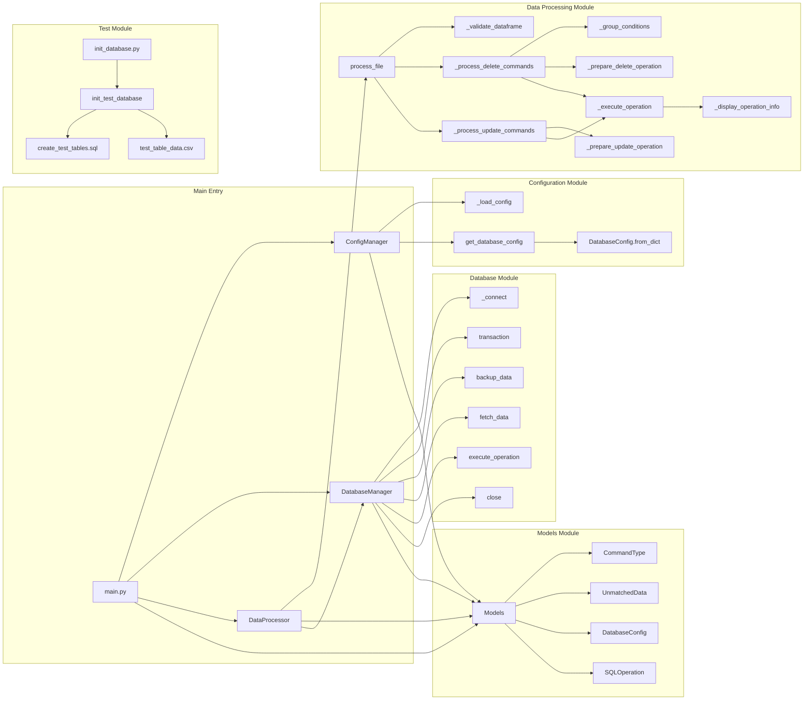

```mermaid
graph LR 
    subgraph Main Entry
        A[main.py] --> B[ConfigManager]
        A --> C[DatabaseManager]
        A --> D[DataProcessor]
    end

    subgraph Configuration Module
        B --> B1[_load_config]
        B --> B2[get_database_config]
        B2 --> B3[DatabaseConfig.from_dict]
    end

    subgraph Database Module
        C --> C1[_connect]
        C --> C2[transaction]
        C --> C3[backup_data]
        C --> C4[fetch_data]
        C --> C5[execute_operation]
        C --> C6[close]
    end

    subgraph Data Processing Module
        D --> D1[process_file]
        D1 --> D2[_validate_dataframe]
        D1 --> D3[_process_delete_commands]
        D1 --> D4[_process_update_commands]
        
        D3 --> D5[_group_conditions]
        D3 --> D6[_prepare_delete_operation]
        D3 --> D7[_execute_operation]
        
        D4 --> D8[_prepare_update_operation]
        D4 --> D7
        
        D7 --> D9[_display_operation_info]
    end

    subgraph Models Module
        E[Models] --> E1[CommandType]
        E --> E2[UnmatchedData]
        E --> E3[DatabaseConfig]
        E --> E4[SQLOperation]
    end

    subgraph Test Module
        F[init_database.py] --> F1[init_test_database]
        F1 --> F2[create_test_tables.sql]
        F1 --> F3[test_table_data.csv]
    end

    %% 模块间的关系
    A --> E
    B --> E
    C --> E
    D --> E
    D --> C
```
