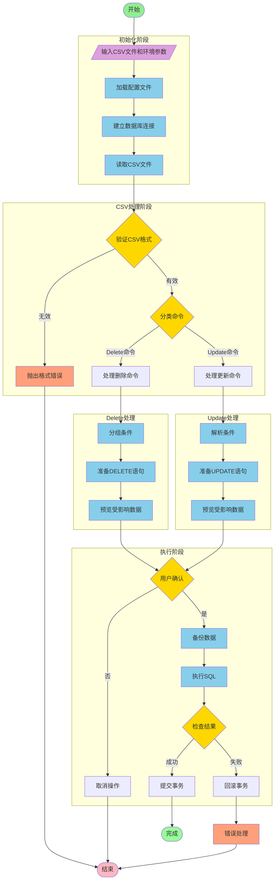

```mermaid
flowchart TD
    Start([开始]) --> Input[/输入CSV文件和环境参数/]
    
    subgraph 初始化阶段
        Input --> LoadConfig[加载配置文件]
        LoadConfig --> ConnDB[建立数据库连接]
        ConnDB --> ReadCSV[读取CSV文件]
    end
    
    subgraph CSV处理阶段
        ReadCSV --> ValidateCSV{验证CSV格式}
        ValidateCSV -->|无效| Error1[抛出格式错误]
        ValidateCSV -->|有效| SplitCommands{分类命令}
        
        SplitCommands -->|Delete命令| ProcessDelete[处理删除命令]
        SplitCommands -->|Update命令| ProcessUpdate[处理更新命令]
    end
    
    subgraph Delete处理
        ProcessDelete --> GroupConditions[分组条件]
        GroupConditions --> PrepareDelete[准备DELETE语句]
        PrepareDelete --> PreviewDelete[预览受影响数据]
    end
    
    subgraph Update处理
        ProcessUpdate --> ParseConditions[解析条件]
        ParseConditions --> PrepareUpdate[准备UPDATE语句]
        PrepareUpdate --> PreviewUpdate[预览受影响数据]
    end
    
    subgraph 执行阶段
        PreviewDelete --> Confirm{用户确认}
        PreviewUpdate --> Confirm
        
        Confirm -->|否| Cancel[取消操作]
        Confirm -->|是| Backup[备份数据]
        
        Backup --> ExecuteSQL[执行SQL]
        ExecuteSQL --> CheckResult{检查结果}
        
        CheckResult -->|成功| Commit[提交事务]
        CheckResult -->|失败| Rollback[回滚事务]
    end
    
    Commit --> Success([完成])
    Rollback --> Error2[错误处理]
    Cancel --> End([结束])
    Error1 --> End
    Error2 --> End
    
    style Start fill:#90EE90
    style End fill:#FFB6C1
    style Success fill:#98FB98
    style Error1 fill:#FFA07A
    style Error2 fill:#FFA07A
    
    classDef process fill:#87CEEB
    classDef decision fill:#FFD700
    classDef io fill:#DDA0DD
    
    class LoadConfig,ConnDB,ReadCSV,GroupConditions,PrepareDelete,PreviewDelete,ParseConditions,PrepareUpdate,PreviewUpdate,Backup,ExecuteSQL process
    class ValidateCSV,SplitCommands,Confirm,CheckResult decision
    class Input io
    
```
